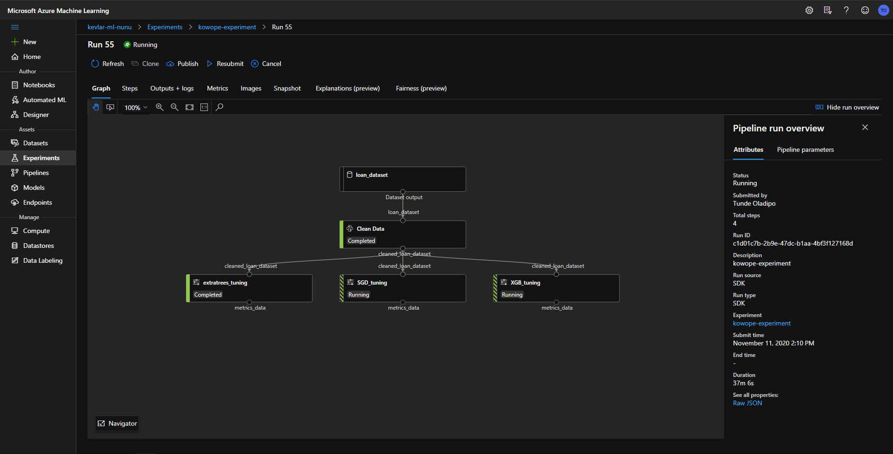
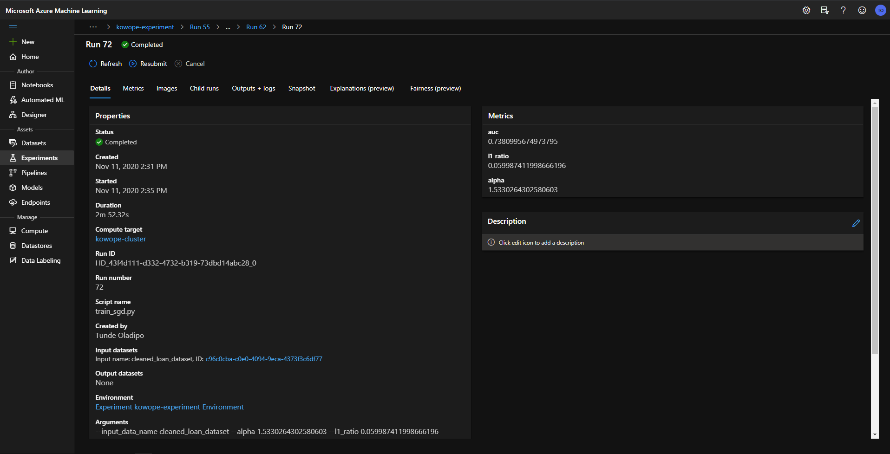

# Predicting Customer Loan Default Status in Kowope Mart
<h2>Table of Contents</h2>
<!-- TOC -->

- [Predicting Customer Loan Default Status in Kowope Mart](#predicting-customer-loan-default-status-in-kowope-mart)
    - [Project Set Up and Installation](#project-set-up-and-installation)
    - [Overview](#overview)
        - [Architecture](#architecture)
        - [Dataset](#dataset)
        - [Task](#task)
        - [Access](#access)
    - [Automated ML](#automated-ml)
        - [Results](#results)
        - [Best AutoML Model](#best-automl-model)
    - [Hyperparameter Tuning](#hyperparameter-tuning)
        - [ExtraTreesClassifier and XGBClassifier](#extratreesclassifier-and-xgbclassifier)
        - [SGDClassifier](#sgdclassifier)
        - [VotingEnsemble](#votingensemble)
        - [Results](#results-1)
            - [HyperDrive RunDetails](#hyperdrive-rundetails)
            - [ExtraTreesClassifier Best Model](#extratreesclassifier-best-model)
            - [SGCClassifier Best Model](#sgcclassifier-best-model)
            - [XGBClassifier Best Model](#xgbclassifier-best-model)
            - [Voting Ensemble Final Model](#voting-ensemble-final-model)
    - [Model Deployment & Testing](#model-deployment--testing)
        - [Active Model](#active-model)
    - [Screen Recording](#screen-recording)
    - [Standout Suggestions](#standout-suggestions)
    - [Future Improvements](#future-improvements)

<!-- /TOC -->

## Project Set Up and Installation
- Create a virtual environment and activate it
```
$ python -m venv env
```
- Clone the project 
```
$ git clone https://github.com/theyorubayesian/nd00333-capstone.git
```
- Install requirements
```
$ pip install -r requirements.txt
```
- Download `config.json` from your Azure Machine Learning Workspace. Alternatively, you can create a workspace as follows:
```python
from azureml.core import Workspace
ws = Workspace.create(name='myworkspace',
           subscription_id='<azure-subscription-id>',
           resource_group='myresourcegroup',
           create_resource_group=True,
           location='eastus2'
           )
ws.write_config(path="./file-path", file_name="config.json")
```
`config.json` is included in`.gitignore` so you do not have to worry about exposing your credentials. Your directory should look like this:
```
├───data
├───scripts
│   └───__init__.py
│   └───.amlignore
│   └───cleaning.py
│   └───score.py
│   └───train.extratrees.py
│   └───train_sgd.py
│   └───train_xgb.py
│   └───utils.py
│   └───voting.py
├───static
├───.gitignore
├───automl.ipynb
├───hyperdrive_tuning.ipynb
├───README.md
└───utils.py
```
- Open the `hyperdrive_tuning` or `automl` notebooks and hack away!
## Overview
This project leverages Azure Machine Learning to help a Retail Mart make informed decisions about what customers to offer loans. In particular, this project demonstrates the cleaning, preprocessing, registering and versioning of datasets; automated machine learning; hyperparameter tuning using HyperDrive; the creation of machine learning pipelines and retrieval of its artefacts (models, transformers) and metrics; and the deployment of a trained model for use. 
### Architecture

### Dataset
The Dataset used for this project is from the Data Science Nigeria Qualification Hackathon hosted on [Zindi](https://zindi.africa/hackathons/dsn-ai-bootcamp-qualification-hackathon). It is pulled from the database of Kowope Mart and contains 56,000 observations and 52 features including the target variable. The features are form fields with descriptions available in the linked Zindi page. All the features are numeric except for `form_field47` and the target column, `default_status`. As is common for tasks such as this, there is a data imbalance. More observations record a default_status of `no` compared to `yes`. 

### Task
Kowope Mart is a Nigerian-based retail company that allows customers request for loans for an agreed duration in order to pay for goods. The company needs a system to predict customer who are likely to default. This projects investigates how such a system may be built by leveraging Kowope Mart's data and Azure's Machine Learing platform.

### Access
Downloading the data requires sending the Zindi API a `POST` request. A custom function, `get_data` to achieve this is included in [utils.py](utils.py). Subsequently, the data is uploaded to the workspace datastore and then used to create a TabularDataset that is registered with the workspace.

## Automated ML
The AutoML experiment was configured to run locally rather than on a compute target. The data is cleaned before it passed into the experiment. Cleaning here involves dropping rows containing greater than a threshold (60%) of missing values and encoding categorical columns. 
The imputation of missing values is left to the AutoML. Thus the `featurization` parameter is set to `auto`. Since no validation dataset is passed into the AutoML, cross validation on the test data is allowed and `n_cross_validations` is set to 4. To enable AutoML stop poorly performing runs, `enable_early_stopping` is set to `True`. Together with `experiment_timeout_minutes` which is set to 30, both parameters help to conserve resources (time and compute) available for experimentation. The aim is for this AutoML experiment to be a precursor to a more involved HyperDrive experiment. To ensure that all the details about this experiment is made available, `verbosity` is set to `logging.INFO` meaning that all events of level `INFO`and on up are logged in the output. 
The next set of parameteres relate specifically to the task at hand and the dataset to be used. The `task` parameter is set to `classification`, the cleaned dataset it passed in as the `training_data` parameter and the `label_column_name` which is `default_status` is specified. The last parameter of note is the `primary_metric`. As mentioned earlier, the dataset is imbalanced thus the `AUC_weighted` primary metric was used. The `AUC_Weighted` aggregates the performance of the model on both classes using each label's area under the `Receiver Operating Characteristic` (A plot of the True Positive and False Positive Rates).  
The AutoML Run is visualised using RunDetails as shown below.

### Results
The AutoML generated interesting parameters:
- It identified columns contains missing values and filled with the mean. It also warned that a better strategy would be to handle the missing values before running the experiment.
- The best model obtained is the `VotingEnsemble` with AUC of `0.8342`. This performance can be improved a number of ways:
    - Investigating the pattern of missing values and exploring more sophisticated ways to fill them
    - Dedicated hyperparameter tuning to further improve model performance
- An examination of model pipeline that the experiment outputted showed that no data transformation was done as shown below:
```
datatransformer
{'enable_dnn': None,
 'enable_feature_sweeping': None,
 'feature_sweeping_config': None,
 'feature_sweeping_timeout': None,
 'featurization_config': None,
 'force_text_dnn': None,
 'is_cross_validation': None,
 'is_onnx_compatible': None,
 'logger': None,
 'observer': None,
 'task': None,
 'working_dir': None}
``` 
- The `VotingEnsemble` used soft voting: meaning that each of its internal estimators predict a probability rather than a class label.
- Eight estimators are used in the ensemble. Each one is fitted with its own scaler. As an example, for the `LightGBMClassifier`, the following parameters are obtained:
```
0 - maxabsscaler
{'copy': True}

0 - lightgbmclassifier
{'boosting_type': 'gbdt',
 'class_weight': None,
 'colsample_bytree': 1.0,
 'importance_type': 'split',
 'learning_rate': 0.1,
 'max_depth': -1,
 'min_child_samples': 20,
 'min_child_weight': 0.001,
 'min_split_gain': 0.0,
 'n_estimators': 100,
 'n_jobs': 1,
 'num_leaves': 31,
 'objective': None,
 'random_state': None,
 'reg_alpha': 0.0,
 'reg_lambda': 0.0,
 'silent': True,
 'subsample': 1.0,
 'subsample_for_bin': 200000,
 'subsample_freq': 0,
 'verbose': -10}
```
### Best AutoML Model

The VotingEnsemble model was downloaded and registered with the workspace. 

## Hyperparameter Tuning
The aim of this HyperDrive experiment is to present a structure with which the performance of the model obtained from the AutoML Model can be improved. As mentioned earlier, the AutoML outputted a Voting Ensemble containing eight estimators. To simplify the task for this section, only three of those models (SGDClassifier, ExtraTreesClassifier and XGBClassifier in place of the RandomForestClassifier) are tuned and used in a final Voting Ensemble.
This experiment was implemented as a pipeline so that the individual hyperdrive steps can used the same dataset and run in parallel. The first step of this pipeline is the `cleanDataStep` that takes in the raw loan dataset and cleans it. The output of this step is collected using the `PipelineData` object and registered as a dataset in the workspace. It may be useful for this pipeline to be published so that retraining can be triggered using `HTTP requests`. As such some parameters are defined using `PipelineParameter` objects so they can passed along in retraining requests. These include `threshold` for dropping columns containing missing values in train data, `dropped_columns`, `n_neighbors` to be used in the `KNNImputer` used to fill missing values.


### ExtraTreesClassifier and XGBClassifier
Both these models belong to the class of ensemble models that combine multiple hypotheses (decision trees) to form a better hypothesis. As an example, given a feature that denotes time of the month, a hypothesis could be: Customers who borrow at the beginning of the month are more likely to default on their loans. Where these two algorithms differ is in how the individual hypotheses are combined. The XGBClassifier generates hypotheses to correct the residuals of previous ones. Whereas, a majority voting is implemented in the case of the ExtraTreesClassifier.  
Parameters tuned here include: `min_child_weight` (>=1), `max_depth` (4 <= x <= 12), `subsample` (0.5 <= x<= 1), `colsample_bytree` (0.5 <= x<= 1), `l1_ratio` etc. The ExtraTreesClassifier takes a hyperparameter `ccp_alpha` which the XGBClassifier does not take. This parameter controls over-fitting and takes values  >= 0. For the XGBoost, early stopping is one way to control over-fitting. The `early_stopping_rounds` is set to 30 for this experiment. 
`BayesianParameterSampling` was used for both these models. 
### SGDClassifier
Unlike the ensemble models above, the SGClassifier belongs to the class of linear models. It implements regularized linear models with stochastic gradient descent learning. Simply put, the Stochastic Gradient Descent is an iterative way to optimize an objective function that relies on gradients and learning rates to reach the optimum. Two parameters are tuned in this experiment: `l1_ratio` which determines the proportion in which the `l1` and `l2` regularizations will be applied; and `alpha` that multiplies the regularization term.  
`RandomParameterSampling` was used here with a `Bandit Policy` of `slack factor` of 0.2. 
### VotingEnsemble
After the optimal parameters for these three models have been found through their hyperdrive runs, they are used as inner estimators for a soft Voting Classifier. The eventual model obtained here is registered in the workspace and deployed in the Model Deployment [section](#model-deployment--testing) below.
### Results
#### HyperDrive RunDetails

The best model from the hyperdrive run of each model, and the Voting Ensemble is presented in screenshots below. 
#### ExtraTreesClassifier Best Model

#### SGCClassifier Best Model

#### XGBClassifier Best Model

#### Voting Ensemble Final Model

The XGBoost performed the best, reaching an AUC of 0. 77. Performance degraded when the three models were used in the VotingEnsemble, achieving an AUC of 0.75. All the models in this experiment performed much worse than the AutoML model. However, this is possibly because the models were limited to 10 total runs for their parameter search. 
Other ways that performance could have been improved include:
- Making a more informed choice about `n_neighbors` used in `KNNImputer`. The current choice of 5 neighbors were chosen arbitrarily.
- Training more models then checking their correlations before using them in a Voting Classifier. The Voting Classifier's performance is best when the internal estimators are sufficiently different. 

## Model Deployment & Testing
A number of things are important to deploying the trained VotingEnsemble model. They include:
- Optimal hyperparameters obtained for the classifiers through the hyperdrive Steps
- Artefacts such as the `KNNImputer` object which was used to impute missing values in the train dataset and the categories of the `OrdinalEncoder` used for `form_field47`
- Metrics such as `useful columns` which was logged during the `cleanDataStep`

These three ensure that the test data undergoes the same preprocessing that the train data did and that it contains only the columns the `VotingEnsemble` was trained on. In addition, the following are necessary for model deployment:
- `score.py` which details how the deployed model interacts with requests
- An inference configuration which specifies the environment into which the model is deployed
- A deployment configuration specifying the resource allocation to the deployment model and additional characteristics such as `Application Insights`


This project uses a custom cell magic `writetemplate` to automatically write some variables such as `parameters` from the notebook into `score.py`. The screenshot below shows the active model endpoint.
### Active Model


By definition, the `run` function in `score.py` requires a a JSON document with the strucure:
```
{
    "data": <model-specific-data-structure>
}
```
To control the creation of such a document, the `CREATE_SAMPLE_DATA` boolean is used. Where `sample_request_data` cannot be found in the workspace, the Test data is downloaded from the `Zindi API` and used to create a defined length of sample data. A request to the deployed endpoint can then be made as follows:
```python
# Code to create the service is here
scoring_uri = service.scoring_uri

# Code to create or retrieve sample_request_data is here

headers = {"Content-Type": "application/json"}

response = requests.post(scoring_uri, sample_request_data_json, headers=headers)
```
Sample results are shown in the screenshot below.

Service logs will contain some useful information about the endpoint's interaction will sample data. The [Standout Suggestions](#standout-suggestions) section discusses this in greater detail.
## Screen Recording
[YouTube link](https://youtu.be/iICUf38knxI)

## Standout Suggestions
- Logging in Deployed Web App 
Logging offers many advantages e.g. easing the debugging process, measuring deployment performance etc.The logging implemented in this project is simple. It involves print statements as shown below:
```python
# Some code appears above this
def init():
    global model
    global imputer
    
    # Some code appears here

    # Load artefacts 
    imputer = joblib.load(imputer_path)
    model = joblib.load(model_path)
    print("Initialized model" + time.strftime("%H:%M:%S"))
```
The service configuration enabled Application Insights as shown below:
```python
deployment_config = AciWebservice.deploy_configuration(cpu_cores=1, memory_gb=2, enable_app_insights=True)
```
The logs can be examined by running `service.get_logs()` as shown below


## Future Improvements
- The service configuration is shown in the [Standout Suggestions](#standout-suggestions) above. The `CPU and Memory requirements` have been decided arbitrarily in consideration with time and resources available. A better strategy in the future would be to profile the model to determine resource utilization. The [documentation](https://docs.microsoft.com/en-us/azure/machine-learning/how-to-deploy-profile-model) details how this can be achieved. 
- This project was developed with a Retail Mart in mind. Many SMEs are embracing offline-first mobile technology to power their businesses. In this unique context, converting the model to ONNX format allowing it to be run on a variety of platforms and devices, and to take advantage of each one's characteristics.  
